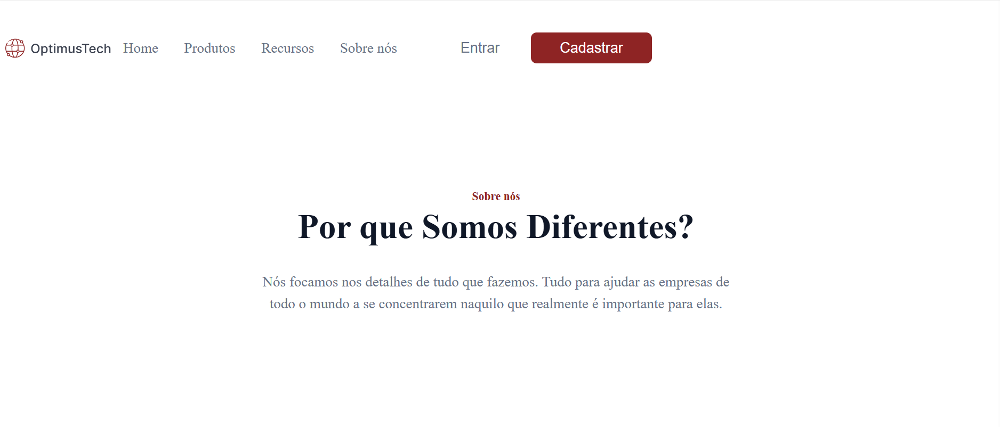

# 7DaysOfCode - Projeto Frontend

Este projeto foi desenvolvido durante o desafio 7DaysOfCode da Alura, utilizando HTML e CSS. O objetivo é criar uma página web responsiva e visualmente atraente para apresentar informações de uma empresa fictícia.

## Demonstração

## Tecnologias Utilizadas

- HTML
- CSS

## Funcionalidades

- Navegação intuitiva com links para diferentes seções.
- Apresentação de métricas da empresa em um layout responsivo.
- Seções informativas sobre a empresa e oportunidades de emprego.

